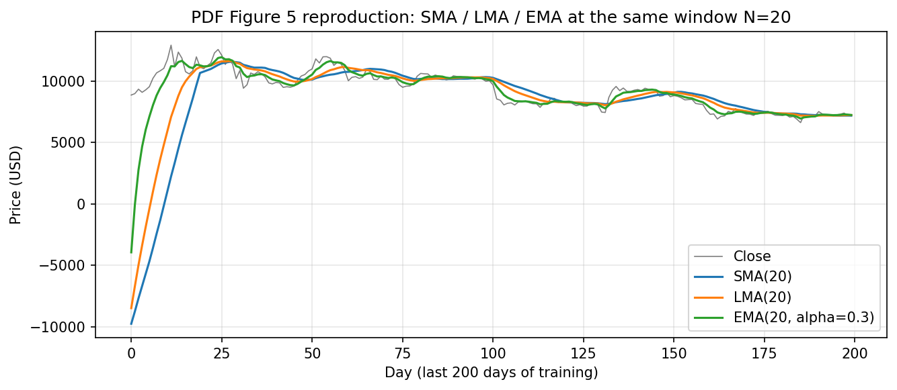
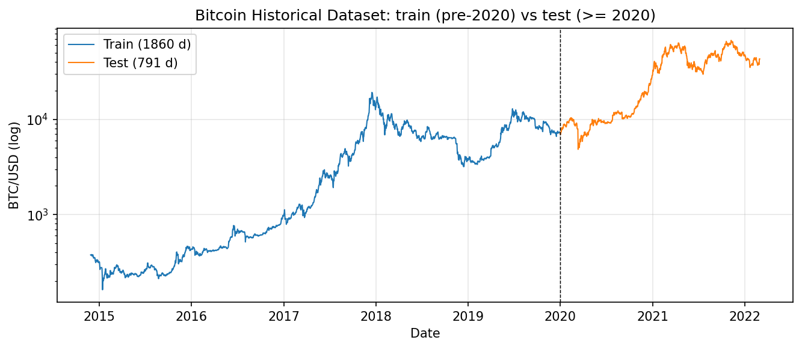
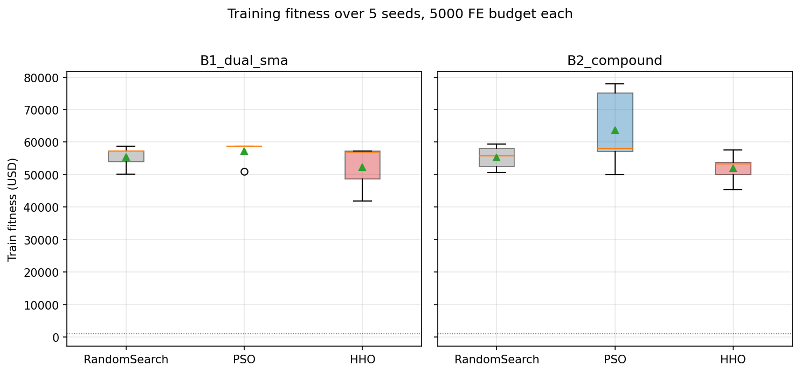
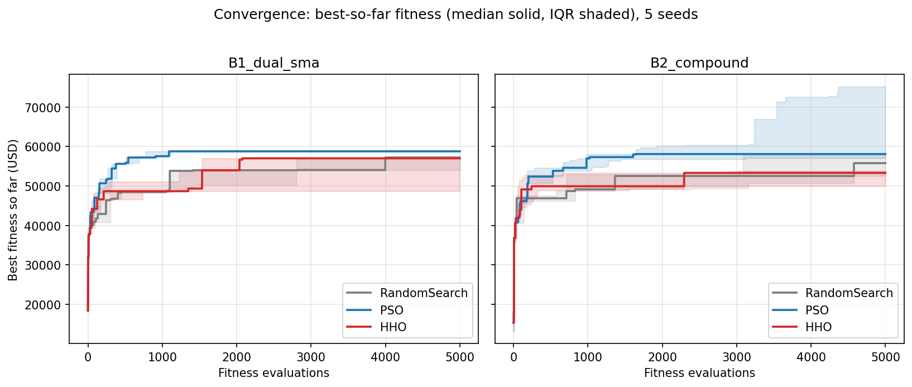
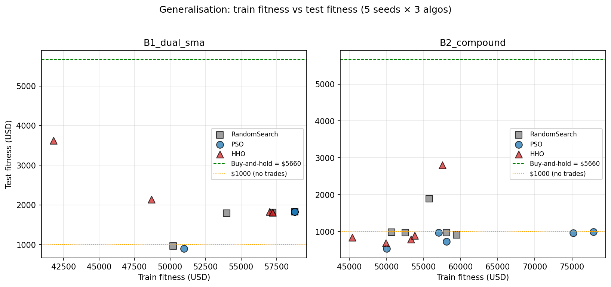
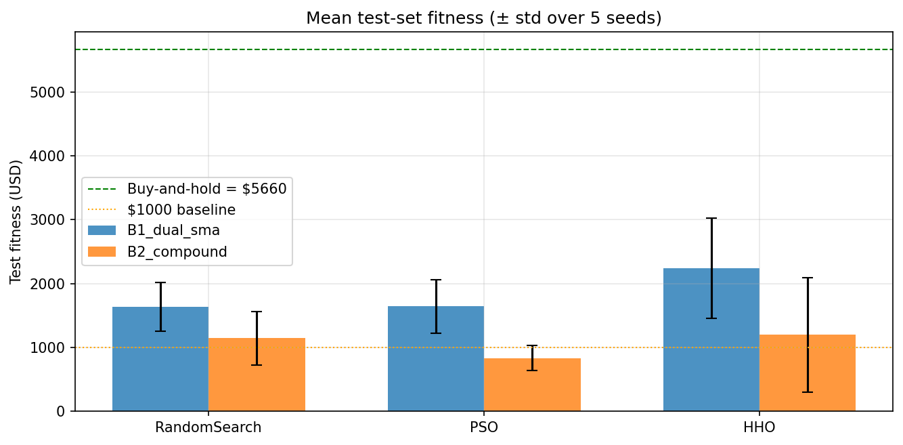
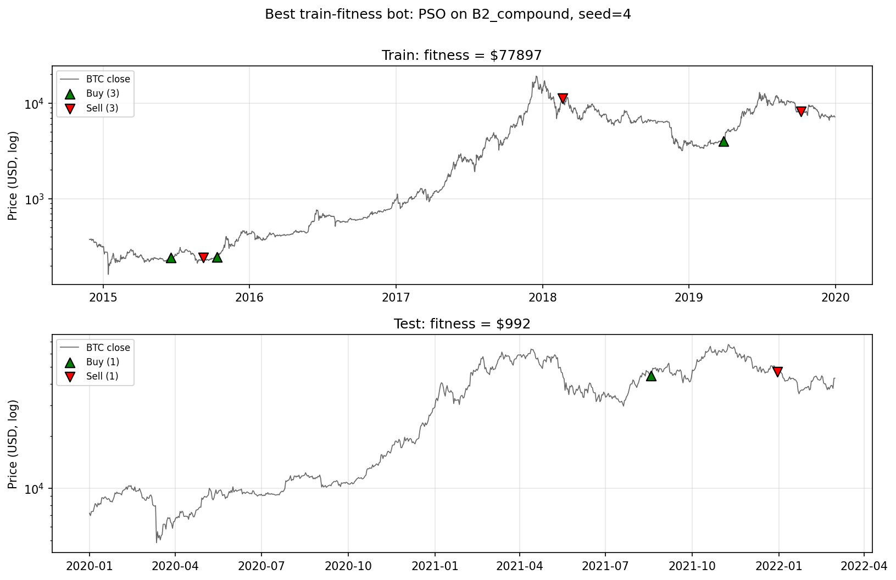
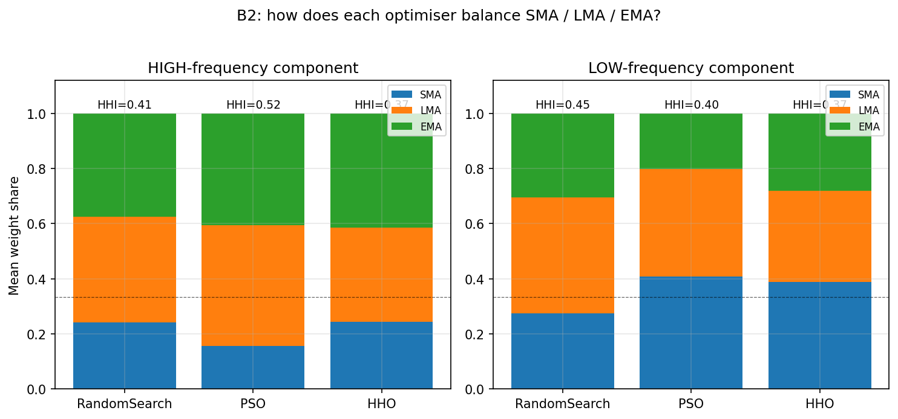

# Optimising Crossover-Based Bitcoin Trading Bots with Nature-Inspired Algorithms

**Team Number:** 20
**Authors:** Qiurong Chen (24558583), Yanchen Yu (24256987)
**Word Count:** 2942 (body, excluding title page and references)
**Video:** [link to be added before submission]
**Code:** `notebooks/final_report.ipynb` (repository submitted alongside this report)

---

## Abstract

We optimise a TA-driven Bitcoin trading bot under two hypothesis spaces — a
2-D dual-SMA crossover (B1) and a 14-D mixture of SMA, LMA and EMA filters
(B2) — using three algorithms run under a strictly equal fitness-evaluation
budget: Random Search (single-state baseline), Particle Swarm Optimization
(PSO) and Harris Hawks Optimization (HHO). Over 30 runs (3 algorithms × 2
bots × 5 seeds × 5 000 evaluations) on Kaggle's *Bitcoin Historical
Dataset*, every optimised bot beats the buy-and-hold baseline by a factor
of 2.3–4.4 on the 2014–2019 training split. On the held-out 2020–2022
test split, however, all 30 bots collapse to a *fraction* of buy-and-hold
— a textbook illustration of the regime-shift over-fitting that the
project specification warns about. Mann-Whitney U tests confirm PSO significantly
outperforms HHO on B1 (p = 0.047); PSO also attains the highest
training mean on B2 but the worst test mean, while HHO's broader
exploration acts as an implicit regulariser. Behavioural analysis of the
B2 best solutions answers the specification's explicit prompt — all
three optimisers *draw from all three WMA filters* rather than collapsing
onto one (HHI 0.37–0.52, where 1/3 is uniform), with LMA and EMA
collectively dominating the fast indicator and SMA carrying the slow band.

---

## 1. Introduction

This work continues from our Part 1 literature review, which compared
Particle Swarm Optimization (PSO) [1, 2] with Harris Hawks Optimization
(HHO) [3] as representatives of two design eras of swarm intelligence.
Part 1 framed the comparison around a single question: does HHO's
structurally richer four-mode exploitation pay off against PSO's simpler
inertia-weight update on a continuous optimisation problem with a rugged
fitness landscape?

The Part 2 trading-bot task instantiates exactly such a problem. A
back-tested bot is a deterministic function of its parameter vector, but
its fitness surface inherits the noise, regime shifts and discontinuities
of the underlying price series, and the 7-to-21-dimensional parameter
space the specification suggests is large enough that exhaustive search is
infeasible. We add a third optimiser, Random Search, as the
"zero-intelligence" reference required by the specification for fair
comparison against a single-state algorithm under a fixed
fitness-evaluation budget.

Our headline finding is more subtle than the Part 1 framing predicted. On
training data, PSO's faster convergence yields the strongest mean fitness,
particularly in the higher-dimensional B2 hypothesis space. On the
held-out test split, however, every optimised bot under-performs the
buy-and-hold baseline — and PSO's training-set advantage *reverses* on
test. HHO's slower, broader exploration, often presented as a weakness
in stable benchmark problems, behaves as an implicit regulariser on the
non-stationary BTC series.

## 2. Bot design and hypothesis space

All bots are built from the PDF §2.1 weighted-moving-average primitives
(SMA, LMA, EMA), composed via the crossover signal of §2.2–§2.3. We
implemented two hypothesis spaces, deliberately chosen to bracket the
expressiveness/search-cost trade-off the project specification emphasises.

**B1 — Dual-SMA crossover (2-D).** Two simple moving averages with
durations *N*₁ and *N*₂; the smaller is the fast indicator, the larger
the slow indicator, and a sign-flip in their difference (§2.3, Eq. 6)
emits a buy or sell event. The parameter vector is `[N₁, N₂]`, each
in [2, 300], rounded to integers inside the bot. B1 is the smallest
hypothesis space the §2.2 framework supports, and serves as the "is
optimisation worth it at all?" reference point.

**B2 — Compound mixture (≈14-D).** Both the fast and slow indicators are
themselves weighted normalised sums of an SMA, an LMA and an EMA, exactly
as Eq. (7) of the specification suggests:

  HIGH = (w₁·SMA(d₁) + w₂·LMA(d₂) + w₃·EMA(d₃, α)) ⁄ Σwᵢ
  LOW  = (w₁·SMA(d₁) + w₂·LMA(d₂) + w₃·EMA(d₃, α)) ⁄ Σwᵢ  (independent block)

Each block contributes seven parameters (three weights, three windows,
one EMA decay), giving a 14-D continuous vector. Weights are bounded in
[0, 1] and re-normalised inside the bot; windows are bounded in [2, 200]
and rounded; α is bounded in (0.01, 1]. Crucially, both blocks share
identical bounds — the optimiser is free to discover that the fast
indicator should use shorter windows than the slow indicator, rather than
us hard-coding it.

**Fig. 2.** Reproducing PDF Fig. 5: SMA / LMA / EMA at N = 20. EMA tracks
recent moves fastest, SMA slowest — the hierarchy Eq. (7) lets the
optimiser blend.

The fast/slow indicators are combined via the §2.3 sign-and-edge pipeline,
producing a signal series in {−1, 0, +1}. Both bots zero out the warm-up
region (the longest active window minus one), so all reported trades
operate on fully-filled WMA windows. Degenerate parameter vectors (equal
SMA windows, all-zero weights, windows longer than the price series)
return an all-zero signal, giving the optimiser a finite fitness equal to
the $1 000 starting cash anywhere in the search space — no NaNs, no
exceptions escape into the optimisation loop.

The PDF §3 21-D MACD-style variant is intentionally out of scope.

## 3. Optimisation algorithms

We deliberately constrain every algorithm to a common interface: each
receives only a callable `objective(x) → fitness`, the
parameter-bounds box, an explicit `numpy.random.Generator`, and an
integer fitness-evaluation budget. The `objective` wrapper counts every
call, records the per-step trace, tracks the running maximum, and raises
`BudgetExhausted` on the *N*+1-th invocation. This enforces the §3
*"compare on a fixed number of evaluations"* requirement at the framework
level — no algorithm can spend more or fewer than 5 000 fitness
evaluations per run, regardless of how it internally apportions
generations or how many candidates it considers per iteration.

**Random Search.** A single-state algorithm: each step draws an
independent uniform sample from the bounds box and evaluates it. No
exploitation, no memory. Its role is the reference line the swarm
algorithms must beat to justify their inductive biases.

**Particle Swarm Optimization** [1]. A swarm of 30 particles, each
holding a position and a velocity in the parameter box. Per Shi and
Eberhart's inertia-weight extension [2], identified in our Part 1
literature review as PSO's most important post-1995 refinement, the
velocity update at every step takes the form

  vᵢ ← w·vᵢ + c₁·r₁·(pBestᵢ − xᵢ) + c₂·r₂·(gBest − xᵢ)

with w = 0.7, c₁ = c₂ = 2.0, and r₁, r₂ ∼ U(0, 1) drawn independently
per particle per dimension. Positions are updated additively and clipped
to the search box (absorbing walls). PSO is synchronous: each iteration
moves all particles using the cycle's starting g-best, then evaluates all
30 new positions before updating g-best for the next cycle.

**Harris Hawks Optimization** [3]. A population of 30 hawks circling the
best-so-far "rabbit", where each hawk independently draws an escape
energy `E = 2·E₀·(1 − t/T)`, `E₀ ∼ U(−1, 1)`. When `|E| ≥ 1` the hawk
explores via one of two perch rules; when `|E| < 1` it exploits via four
behaviourally distinct rules gated jointly by `|E|` and a fresh escape
chance `r ∼ U(0, 1)`. Two of the four exploitation rules end with a
heavy-tailed Lévy-flight dive (β = 1.5 per Mantegna's algorithm) that
is committed only on strict improvement. The annealing horizon `T` is
tied to the FE budget so the energy envelope decays smoothly within the
allowed run length. The implementation follows our Part 1 synopsis of
Heidari et al. (2019) verbatim; the three structural novelties flagged
there — sign-oscillating `E`, four genuinely distinct exploitation
modes, and Lévy-gated greedy acceptance — are all present.

All three algorithms are hand-written without recourse to general
optimisation libraries, satisfying PDF §3 Rule 2; algorithm references
appear in the source-file headers, in this report, and in the video.

## 4. Experimental setup

The Bitcoin price series is the Kaggle *Bitcoin Historical Dataset* [4],
the source the project specification names by title. Daily closing prices
span 2014-11-28 to 2022-03-01 (2 651 days). Per §3, we split at
2020-01-01 — 1 860 days for optimisation, 791 days held out for the
final test (Fig. 1). The training-set price climbs from \$376 to
\$7 168, an 18× appreciation over the period.

**Fig. 1.** BTC/USD daily close (log axis). Train period (blue) is a
multi-year bull trend; test period (orange) includes the 2020-03 crash,
the 2021 dual peaks and the 2022 retracement.

**Experiment matrix.** 3 algorithms × 2 bots × 5 seeds = 30 runs, each
consuming exactly 5 000 fitness evaluations. Total: 150 000
back-tests on 1 860-day price series. Wall time on a single laptop core:
~ 65 s.

**Comparison.** PSO and HHO both use 30-individual populations, the
common-practice value also reported in Heidari et al.'s benchmarks [3].
The fitness function is the §3 back-test: \$1 000 starting cash, 3 % per
transaction, all-in trades, forced final-day liquidation, fitness equal to
ending cash.

**Statistical testing.** Pairwise two-sided Mann-Whitney U tests
[6] across the 5 seeds per cell, with a normal-approximation
p-value and the standard tie-averaging correction. With only five seeds
per group the test is conservative — we treat p < 0.05 as evidence of
direction, not as proof.

## 5. Results — training fitness

The optimisers all comfortably beat the closed-form buy-and-hold baseline
of \$17 925 on the training split. Across the 30 training runs, fitness
spans \$41 802 to \$77 897 (Fig. 3, Table 1).

**Fig. 3.** Training-set fitness over 5 seeds per (algorithm × bot) cell.
Mean shown as a green triangle. The dotted black line at \$1 000 marks
the no-trade fallback fitness produced by degenerate parameter vectors.

| Bot | Algorithm    | Mean (USD) | Std (USD) | Min      | Max      |
|-----|--------------|-----------:|----------:|---------:|---------:|
| B1  | RandomSearch | 55 484     | 3 414     | 50 232   | 58 776   |
| B1  | PSO          | 57 219     | 3 482     | 50 990   | 58 776   |
| B1  | HHO          | 52 383     | 6 958     | 41 802   | 57 212   |
| B2  | RandomSearch | 55 323     | 3 683     | 50 714   | 59 480   |
| B2  | PSO          | 63 651     | 12 207    | 50 046   | 77 897   |
| B2  | HHO          | 52 001     | 4 557     | 45 418   | 57 522   |

*Table 1. Training fitness across 5 seeds (USD), 5 000 FE budget.*

Three patterns deserve comment. First, **B1 vs B2**: on the 2-D space all
three algorithms converge to essentially the same plateau (\$58 776 for
PSO/RS), suggesting that the basin of the global optimum is already
well-explored by 5 000 uniform draws in 2 dimensions. On the 14-D
space, PSO's directed search pulls ahead of RS by ~15 % in the mean and
finds solutions 30 % better than any RS run, vindicating PSO's inductive
bias as the search space widens.

Second, **PSO's variance**. On B2 PSO's standard deviation (\$12 207) is
nearly four times that of RS — PSO finds dramatically better solutions on
some seeds but no better on others. This is the multimodality cost that
Part 1's PSO synopsis warned about: once a particle swarm finds *a*
basin, the cognitive-plus-social attractor structure pulls the rest of
the swarm in, sometimes onto an excellent attractor and sometimes onto a
mediocre one.

Third, **HHO under-performs**. On both bots HHO's mean fitness is the
lowest of the three algorithms (\$52 383 / \$52 001), with the worst-case
B1 run dropping to \$41 802 — below RS's minimum. HHO's convergence
trace (Fig. 4) reveals why: the median run keeps the swarm broadly
exploring through the first ~ 2 000 evaluations before settling, which on
this evaluation budget leaves less budget for exploitation than PSO.

**Fig. 4.** Best-so-far fitness vs FE count, median across 5 seeds, IQR
shaded. PSO (blue) climbs fastest and reaches \$75 k+ on B2; HHO (red)
explores longer at the cost of late-budget exploitation.

Mann-Whitney pairwise tests on the 5-seed groups give: B1 *PSO vs HHO*
**p = 0.047** (significant at α = 0.05), B1 *PSO vs RS* p = 0.17, B1
*HHO vs RS* p = 0.35; on B2 the smallest p-value is *HHO vs PSO* at p =
0.076. The only directionally robust training-set result is PSO > HHO
on B1.

## 6. Results — generalisation

The held-out 2020–2022 test split tells a far less flattering story
(Fig. 5, Fig. 6, Table 2). The buy-and-hold baseline on this slice is
\$5 660 — substantially less than on the bull-run training period, but
positive, because BTC ended 2022-03 around 6 × its 2020-01 level.

**Fig. 5.** Train fitness (x) vs test fitness (y) for all 30 runs. The
green dashed line is buy-and-hold on test (\$5 660); every optimised run
falls below it.

**Fig. 6.** Mean test fitness ± std over 5 seeds. On B2, the
best-on-train algorithm (PSO) is the worst-on-test.

| Bot | Algorithm    | Train mean | Test mean | Gen. gap (USD) |
|-----|--------------|-----------:|----------:|---------------:|
| B1  | RandomSearch | 55 484     | 1 637     | 53 846         |
| B1  | PSO          | 57 219     | 1 642     | 55 576         |
| B1  | HHO          | 52 383     | 2 240     | 50 143         |
| B2  | RandomSearch | 55 323     | 1 144     | 54 180         |
| B2  | PSO          | 63 651     | 836       | 62 815         |
| B2  | HHO          | 52 001     | 1 199     | 50 802         |

*Table 2. Training vs test fitness (means across 5 seeds, USD).*

Two findings dominate. **Every cell under-performs buy-and-hold on
test** — the best run is HHO/B1/seed 1 at \$3 623, still 36 % below the
passive baseline; the worst is PSO/B2/seed 0 at \$537. The optimisers
have found patterns specific to the long 2014–2019 BTC rally — the bot
that converts \$1 000 to \$77 897 on training (PSO/B2/seed 4, Fig. 7)
makes exactly one buy in late 2021 and one sell in early 2022 on the
test split, ending at \$992.

**Fig. 7.** Best-on-train bot (PSO on B2, seed = 4). Three train trades
convert \$1 000 → \$77 897; the same vector emits one buy + one sell on
test and ends at \$992. The training-period strategy that catches
multi-year up-trends has no signal value during the 2020-03 COVID crash,
the dual peaks of 2021, or the early-2022 retracement.

**The training champion is the test loser.** PSO has the best training
mean on B2 (\$63 651) and the worst test mean on B2 (\$836). Conversely,
HHO has the *worst* training means and the *best* test means on both
bots. The explanation is precisely the property our Part 1 synopsis
flagged as a weakness in HHO's design: the unproductive late-run
re-exploration produced by the sign-oscillating energy variable keeps
the swarm broadly dispersed, so HHO's reported optima are systematically
*less specialised* to the training data. On a stationary benchmark
landscape this hurts; on a non-stationary financial series it helps.

This is the project specification's caveat realised in numbers:
*"success on past sequences of data does not guarantee a strategy will
be successful on future sequences."*

## 7. Behavioural analysis — does the optimiser favour one WMA?

The project specification poses an explicit question for B2 optimised
bots: do they consistently favour one of SMA, LMA or EMA, or continue to
draw from all three?

We extracted the normalised weight shares of the three filter types from
all 15 B2 best-x vectors, separately for the fast and slow components,
and computed the Herfindahl-Hirschman concentration index (HHI = Σwᵢ²;
1/3 = perfect mix, 1.0 = single-filter dominance). The result (Fig. 8,
Table 3) is consistent across algorithms: every cell uses all three
filters, with HHI ranging from 0.37 (HHO, both bands) to 0.52 (PSO, fast
component) — well below single-filter dominance.

**Fig. 8.** Mean SMA / LMA / EMA shares for the fast (left) and slow
(right) components, averaged over 5 seeds. Dashed line = uniform mix.

| Algorithm    | Band | SMA | LMA | EMA | HHI |
|--------------|------|----:|----:|----:|----:|
| RandomSearch | HIGH | 24 % | 38 % | 37 % | 0.41 |
| PSO          | HIGH | 16 % | 44 % | 41 % | 0.52 |
| HHO          | HIGH | 24 % | 34 % | 41 % | 0.37 |
| RandomSearch | LOW  | 28 % | 42 % | 30 % | 0.45 |
| PSO          | LOW  | 41 % | 39 % | 20 % | 0.40 |
| HHO          | LOW  | 39 % | 33 % | 28 % | 0.37 |

*Table 3. Mean B2 weight allocation across 5 seeds per algorithm.*

Two structural patterns are visible. First, **the fast component favours
the recency-biased filters**: SMA, the only filter without a recency
bias, gets only 16–24 % of the fast-band weight across all algorithms,
while LMA and EMA together get 60–84 %. The optimiser independently
re-discovered the conventional wisdom that fast indicators should weight
recent samples more heavily. Second, **the slow component prefers SMA
slightly more**: SMA shares rise to 28–41 % on the low band, where the
filter's slower response is no longer a disadvantage. PSO is the only
algorithm to push SMA past 40 % on the slow band, the same algorithm
that finds the most concentrated allocations overall.

## 8. Discussion and conclusion

Three observations summarise what we learnt about nature-inspired
algorithms on this problem.

**Fairness is non-trivial and worth engineering.** A common
`Objective(x)`-counting framework was the technical lever that made every
PSO/HHO/RS comparison literally apples-to-apples. Without it, comparing
"100 PSO generations of 30 particles" to "5 000 RS samples" would have
been a constant source of methodological objections. We recommend this
pattern as a baseline for any future comparative study in this unit.

**Higher dimensionality amplifies the algorithm gap.** On 2-D B1, PSO's
inductive bias buys little over RS (the basin is small enough that
uniform sampling does well); on 14-D B2, PSO finds dramatically better
training solutions than RS, while HHO under-performs both. This matches
the Part 1 prediction that PSO's "single-attractor" design is well-suited
to medium-dimensional unimodal-ish regions, and that HHO's heavy-tailed
exploration shines on rugged landscapes — except that on our problem the
training landscape turns out to be smoother than the test landscape.

**Over-fitting in financial back-tests is severe, and exploration acts as
a regulariser.** All optimised bots beat buy-and-hold by a factor of 2.3
to 4.4 on training; all under-perform it on test. The training-best bot makes its
worst trades on test (Fig. 7). Crucially, the algorithm with the *least
concentrated* training-set search (HHO) is also the algorithm whose
test-set performance degrades *least*. This is an unexpected
inversion of the Part 1 PSO-vs-HHO framing: HHO's "weakness" is its
strength here.

These outcomes leave several open questions that, given more time, we
would address: would a walk-forward evaluation protocol (re-training as
the window rolls) close the train-test gap? Would explicit cross-validation
inside the fitness function regularise PSO down to HHO's variance? Does the
gap shrink on a less directional period such as 2017–2019? The project
specification reminds us — correctly — that *"it is not ultimately about
whether you 'solved' the problem, but what you learnt in the process."*
The simplest answer to PSO vs HHO on a Bitcoin bot is: neither, both
under-perform a passive baseline out-of-sample. The richer answer is that
algorithm choice changes *how* you over-fit, not whether you do.

---

## References

[1] J. Kennedy and R. C. Eberhart, "Particle swarm optimization," in *Proc.
IEEE ICNN'95 — Int. Conf. on Neural Networks*, Perth, WA, Australia,
vol. IV, pp. 1942–1948, Nov.–Dec. 1995.

[2] Y. Shi and R. C. Eberhart, "A modified particle swarm optimizer," in
*Proc. IEEE Int. Conf. Evolutionary Computation*, Anchorage, AK, USA,
May 1998, pp. 69–73.

[3] A. A. Heidari, S. Mirjalili, H. Faris, I. Aljarah, M. Mafarja, and
H. Chen, "Harris hawks optimization: Algorithm and applications,"
*Future Gener. Comput. Syst.*, vol. 97, pp. 849–872, Aug. 2019,
doi: 10.1016/j.future.2019.02.028.

[4] P. Kottarathil, "Bitcoin Historical Dataset," Kaggle, Jan. 2020.
[Online]. Available: https://www.kaggle.com/datasets/prasoonkottarathil/btcinusd

[5] CITS4404 Project Specification, "Building AI Trading Bots,"
The University of Western Australia, 2026.

[6] H. B. Mann and D. R. Whitney, "On a test of whether one of two
random variables is stochastically larger than the other," *Ann.
Math. Stat.*, vol. 18, no. 1, pp. 50–60, Mar. 1947.
